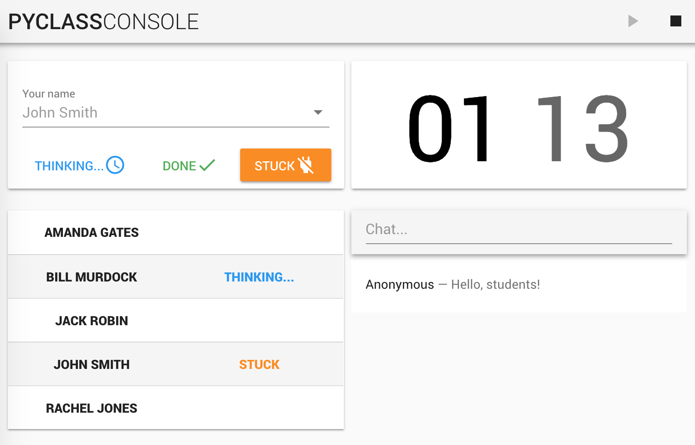

# PyClass Console

* Built-in chat
* Simple authorization (no auth at all)
* Teacher can start/stop task timer
* Students report on task completion status by pressing "thinking", "done" or "stuck" in their consoles
* Realtime single page application built with web sockets
* Material design via Vuetify

## Software stack

vue2, vuetify, socket.io, flask

## Screenshot



## Frontend

### Project setup
```
yarn install
```

#### Compiles and hot-reloads for development
```
yarn run serve
```

#### Compiles and minifies for production
```
yarn run build
```

#### Run your tests
```
yarn run test
```

#### Lints and fixes files
```
yarn run lint
```

#### Customize configuration
See [Configuration Reference](https://cli.vuejs.org/config/).

## Backend

### Installation

You might want to setup your favorite virtual env. Not covered in this doc.

```
pip install -r requirements.txt
```

### Development mode
```
FLASK_DEBUG=1 python main.py
```

### Production mode
```
FLASK_DEBUG=0 python main.py
```

## Configuration

Create `students.txt` with names of students (one per line), update `VUE_APP_BACKEND_ADDRESS` in .env.development if required.

## Alternative production mode
```
docker build . --tag pyclass-console
docker run -d -p 0.0.0.0:5000:5000 pyclass-console
```
